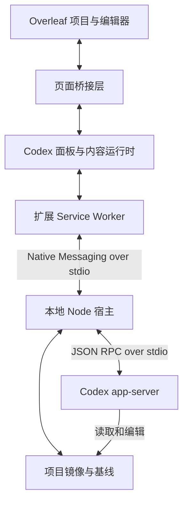

<div align="center">
  
  <h1>Codex Overleaf Link SJTU</h1>
  <p><strong>让 Codex 融入 Overleaf。</strong></p>
  <p><strong>添加对[中文 Overleaf](https://cn.overleaf.com/project/) 与 [SJTU Overleaf](https://latex.sjtu.edu.cn/project) 的支持。</strong></p>
  <p>
    
    
    
    
    <a href="https://github.com/Ghqqqq/codex-overleaf-link/actions/workflows/test.yml"></a>
    
    
  </p>
</div>

---

## 为什么需要它

Overleaf 擅长协作式 LaTeX 写作，Codex 擅长 AI 辅助编辑。在两个工具之间来回切换，往往会打断写作流程，也让 Overleaf 的实时协作与 Codex 的本地代理工作流难以兼顾。

Codex Overleaf Link 将 Codex 面板直接嵌入 Overleaf，并在本机维护项目镜像。通过 **Ask** 阅读和分析项目，或通过 **Auto** 编辑本地工作区，再经浏览器将符合条件的改动写回 Overleaf。项目规则、冲突检查、Track Changes 集成和逐轮恢复机制共同约束写入过程。


*示例项目中的 v2.3.4 面板：Ask / Auto、Track / Compile 和模型设置始终位于文档旁边。*

[安装](#安装) · [任务模式](#任务模式与审阅) · [模型与 API](#模型与-api-服务) · [常见工作流](#常见工作流) · [故障排查](#常见问题与故障排查) · [开发](#开发)

## 功能

- **Ask 和 Auto**：只读分析，或在冲突检查、项目规则及可选 Track Changes 的约束下编辑。写入后可查看文本差异，并使用该轮可用的 Accept / Undo 操作。
- **实时进度与后续输入**：查看 Codex 事件、取消任务、将下一条消息加入队列，或在条件就绪时通过 **Guide** 把排队消息送入当前任务。暂停的队列可从面板恢复。
- **会话历史**：新建、重命名、继续或删除会话；复制结果，或从符合条件的对话节点分叉出新会话。最近项目历史便于返回之前的工作。
- **项目上下文**：通过 `@` 自动补全或 **＋** 上下文面板选择文件，加入 `@compile-log`，也可粘贴或拖入文件作为下一轮的附件。
- **二进制资产**：Codex 生成的图片、PDF 等受支持资产，在 Overleaf 中新建或覆盖前需要单独确认。分块传输支持超过单条 Native Messaging 响应容量的文件。
- **编译反馈**：**Compile** 开关会在符合条件的文件写入后请求 Overleaf 重新编译，并记录结果。Ask 模式不会触发写入后的自动编译。
- **项目规则与运行前检查**：只读 / 可写路径规则约束浏览器写入；敏感内容检测会在上下文发送给 Codex 前进行检查。焦点文件用于优先组织上下文，持续的写入范围限制应通过项目规则设置。
- **模型与技能**：发现本地 Codex 可用模型，选择受支持的推理强度和速度设置，通过斜杠菜单安装或选择 Codex Overleaf 技能。技能加载及单个技能的启用状态均可配置。
- **本地记录与诊断**：保留运行结果和恢复依据，检查诊断信息，导出脱敏的问题报告包。插件的 Codex 会话使用独立的主目录。
- **OT 预热镜像**（Operational Transformation，操作变换）：可选的只读观察机制会跟踪当前 Overleaf 文本编辑器的改动，让相关焦点文件的本地镜像保持预热。该功能默认关闭；不可用、过期或状态不一致时，会回退到常规项目快照读取。向 Overleaf 写回仍经过页面桥接层。

OT 预热数据的有效期为 30 秒；使用焦点文件预热启动时，仍会通过页面桥接层校验当前文件内容。OT 观察不会证明整个项目都是最新状态，也不会替代 Overleaf 写回路径。

### 实验性功能

- **第三方模型服务**：在设置中配置 Responses API、兼容 OpenAI 的 Chat Completions，或 Anthropic Messages 接口。本地 Codex CLI 仍负责代理执行，由本地协议桥接层适配所选接口。兼容性取决于模型和网关，默认仍使用内置 Codex 服务。
- **并行子代理**：为可拆分任务启用 `parallel-subagents` 技能。Native Host 按分配的文件运行多个工作代理，该技能也可将单个文件拆为章节任务。进度会显示在时间线中；检测到文件归属违规时，相应改动不会写回 Overleaf。

## 环境要求

| 要求 | 说明 |
|------|------|
| macOS / Windows / Linux | Native Messaging 宿主注册在当前用户对应的浏览器位置。 |
| Chrome / Chromium | 支持 macOS Chrome、Windows Chrome 和 Linux Chrome。Linux Chromium 需要使用 `--browser chromium` 安装；目前不承诺支持 macOS Chromium 或 Windows Chromium。 |
| Node.js >= 20 | 用于运行本地宿主桥接程序。 |
| Git | 一键源码安装脚本和手动检出安装流程需要 Git。 |
| Codex CLI | 已安装，可用 `codex --version` 检查。使用内置 Codex 服务时需要登录；第三方服务也依赖本地 Codex CLI。 |
| Overleaf 账号 | 对 `overleaf.com` 上的目标项目有访问权限。 |
| TeX 发行版（可选） | 用于 `latexmk` 等本地编译检查。 |

## 安装

Codex Overleaf Link 包含两个部分：**本地宿主（Native Host）**和 **Chrome 扩展**。本地宿主是运行在本机的 Node.js 桥接程序，负责连接浏览器与 Codex。推荐让 Codex 完成托管安装，下方也保留安装脚本和 npm 命令。

Chrome 可能要求手动执行 **Load unpacked（加载已解压的扩展程序）**或 **Reload（重新加载）**。Codex 应说明剩余步骤，并遵守浏览器和操作系统的权限限制。

### 方式 A：让 Codex 安装（推荐）

将以下提示词交给在 Chrome 所在电脑上具有终端权限的 Codex：

```text
请在当前电脑上安装 Codex Overleaf Link：https://github.com/Ghqqqq/codex-overleaf-link

先阅读官方 README 和安装脚本，识别操作系统，检查 Node.js >= 20、Codex CLI 以及所选安装方式需要的其他前提。
除非已指定版本，否则选择 GitHub 上最新已发布的稳定版，排除草稿和预发布版本。按文档使用托管安装，安装版本一致的 Extension 和 Native Host，不要用尚未发布的 main 源码代替稳定版。
已有 Chrome 配置文件和托管安装时优先复用，保留项目文件、会话历史、设置及 Provider 凭据。不要输出密钥，也不要未经同意移除已有安装。
完成终端侧的安装和检查。若 Chrome 要求手动加载已解压的扩展或重新加载，给出准确的托管扩展目录和剩余步骤，不要绕过浏览器限制。
最后报告所选发布版本、已安装的 Extension 和 Native Host 版本、可观测到的浏览器实际加载版本，以及 Native 连接检查结果。磁盘版本一致不能证明 Chrome 已加载更新；需要人工完成的操作应明确列出。
```

### 方式 B：安装脚本

一条命令安装配套的托管 Native Host 和扩展运行时。在 macOS/Linux 上，如果对应路径可用，还会创建方便选择的 `~/Codex Overleaf Link Extension` 快捷入口。脚本会尝试在 macOS 和 Windows 上复制扩展路径，并在 macOS 上打开 Chrome 扩展管理页。所有平台都会打印需要加载的目录。后续签名正式版更新会沿用该托管目录。

macOS / Linux：

```bash
CODEX_OVERLEAF_REF=v2.4.0 bash -c "$(curl -fsSL https://raw.githubusercontent.com/Ghqqqq/codex-overleaf-link/v2.4.0/install.sh)"
```

Windows PowerShell：

```powershell
iwr https://raw.githubusercontent.com/Ghqqqq/codex-overleaf-link/v2.4.0/install.ps1 -OutFile install.ps1
$env:CODEX_OVERLEAF_REF='v2.4.0'
powershell -ExecutionPolicy Bypass -File install.ps1
```

随后打开 `chrome://extensions`，启用 **Developer mode（开发者模式）**，点击 **Load unpacked（加载已解压的扩展程序）**，选择安装器打印的扩展目录。如果安装器提示路径已复制，可将其粘贴到目录选择器中。

### 方式 C：npm 托管安装

`npm exec` 会安装相同的托管 Native Host 和扩展运行时，无需保留源码检出目录。适合希望固定 npm 包版本的安装方式。

```bash
npm exec --yes codex-overleaf-link@2.4.0 -- install-managed
```

随后在 `chrome://extensions` 中启用开发者模式，点击加载已解压的扩展程序，并选择命令打印的托管扩展目录。Release 中的扩展 ZIP 也仍可用于明确采用非托管方式的手动安装。

### 打开 Overleaf

打开 `overleaf.com` 上的项目，右侧会出现 Codex 面板。先通过诊断确认 Native Host 已连接，再从 **Ask** 模式开始。需要编辑时切换为 **Auto**，并按需启用 **Track**。Auto 会直接写入符合条件的改动；Track 会将受支持的文本编辑记录为 Overleaf 留痕，供写入后检查和接受。详见[任务模式与审阅](#任务模式与审阅)。

面板可通过标题栏关闭，再通过 Overleaf 页面边缘的 Codex 控件重新打开。扩展弹出页控制是否显示该边缘入口。面板支持深色、浅色和跟随系统主题，以及英文和中文界面。

外观、语言及全局技能偏好会在同一 Chrome 配置文件的 Overleaf 标签页之间同步，并在重新打开项目列表或项目时恢复。Preload project context（预加载项目上下文）设置也会跨刷新保留。

官方扩展内置固定密钥，常规安装无需提供 `--extension-id`。如果 Chrome 为自定义构建分配了其他 ID，应使用对应安装器重新安装，并传入 `--extension-id <chrome-extension-id>`，使 Native Messaging 清单中的 `allowed_origins` 与实际扩展匹配。详见[扩展 ID](#扩展-id)。

<details>
<summary><strong>手动检出源码安装</strong>（自定义位置）</summary>

```bash
git clone https://github.com/Ghqqqq/codex-overleaf-link.git
cd codex-overleaf-link
npm ci
npm run build:content
npm run install:native
```

随后在 Chrome 中将 `extension/` 加载为已解压的扩展程序。这种源码安装采用非托管方式：扩展代码变化后需要重新构建并重新加载，Native Host 运行时变化后需要重新安装。如果扩展 ID 不同，应重新执行 `npm run install:native -- --extension-id <chrome-extension-id>`。

</details>

## 任务模式与审阅

任务模式只有 Ask 和 Auto。Track 是独立控制 Auto 写入方式的设置。

| 模式 / Track 设置 | 执行行为 | 结果检查方式 |
|------------------|----------|--------------|
| **Ask** | Codex 阅读并分析项目；即使产生本地改动，也不会写回 Overleaf。 | 阅读回答，需要编辑时再切换为 Auto。 |
| **Auto + Track 开启** | 立即写入符合条件的改动；受支持的文本编辑记录在 Overleaf Reviewing / Track Changes 中。如果无法确认所需模式，本轮会被阻止。 | 查看写入差异与 Overleaf 留痕，再使用该轮可用的 **Accept** 或 **Undo** 操作。 |
| **Auto + Track 关闭** | 确认 Overleaf 处于 Editing 模式后写入符合条件的改动。 | 查看写入差异；存在恢复依据时可使用 **Undo**。 |

Auto 文本写入不会等待逐个差异块的事前批准。删除文件、创建或覆盖二进制资产需要单独确认。Track 适用于受支持的文本编辑，并不能让所有文件树操作或二进制操作都变得可撤销。

**Accept** 用于确认某轮的留痕文本改动，并使 Overleaf 保持在 Editing 模式。如果操作意外产生新的留痕，扩展会尝试回滚，并报告能够确认的结果。

> [!WARNING]
> 如果相关文件中还有其他任务或协作者的待审留痕，应暂时避免使用运行卡片中的 **Accept**。应通过 Overleaf 原生 Review 面板逐条审阅和接受这些改动。仅凭 Accepted 标识或编译成功，无法证明无关的待审留痕已得到保留。

**Undo** 使用该轮保存的恢复信息。并发改动或不完整的验证可能阻止完整恢复。Cancel 会停止后续工作，但不会自动撤销已经写入 Overleaf 的内容；应查看运行卡片中的已写入部分和可用恢复操作。

Suggest 模式已在 v2.3.1 移除。需要可审阅的编辑流程时，可使用 **Auto + Track**，在写入后检查改动。

## 模型与 API 服务

默认的 **Built-in Codex（内置 Codex）** 使用本地 Codex CLI 的身份认证、模型目录和服务配置。也可以连接实验性第三方 API，同时保留相同的 Overleaf 面板、本地工作区和 Codex 代理工作流。

### 添加或切换模型服务

1. 打开 **Project Settings → Model providers → Configure**，选择 **+ Add provider**。
2. 填写 **Provider name**、**Base URL**、**API key** 和 **Default model** ID。其他模型 ID 可填入 **Additional models**，每行一个。第三方服务使用此配置列表，模型 ID 必须与接口实际接受的名称一致。除 localhost 外，接口必须使用 HTTPS。
3. 在 **Advanced compatibility** 中，将 **API protocol** 保持为 Auto，或选择接口支持的协议。如果 URL 已包含完整协议端点路径，应启用 **Base URL is the full protocol endpoint**。
4. 检查端点披露信息。可选的 **Test connection** 会向选定的测试模型发送真实请求。选择 **Save** 保存配置，或选择 **Save and use for this project** 将其用于当前项目的后续任务。

切换已保存的服务时，在对话框中选中目标配置，点击 **Use for this project**，并在提示时确认 **Switch provider**。恢复默认服务时，选择 **Built-in Codex → Use for this project**。返回输入区后，可通过模型控件选择已配置的模型及其支持的推理设置。**Current project** 标签表示当前项目选中的服务。

服务配置在本机跨项目共享，当前选择则作用于**当前项目中的所有会话**。切换服务会保留既有运行历史，并为后续轮次开启新的服务线程；模型、推理强度和速度选项可能随之改变。编辑共享配置可能影响其他使用该配置的项目。已经提交或排队的任务保留提交时捕获的服务配置；如果配置变更导致该修订版本不可用，需要重新提交任务。

项目列表页支持管理共享服务配置。选择某个项目实际使用的服务前，需要先进入该项目。

### 支持的 API 格式

| API 协议 | 适用场景 |
|----------|----------|
| **Auto (detect during test)** | 在连接测试或首次使用时协商兼容的请求路径。 |
| **Responses API** | 接受 Responses API 格式的端点。 |
| **Chat Completions** | 兼容 OpenAI Chat Completions 的端点。 |
| **Anthropic Messages** | 接受 Anthropic Messages 格式的端点。 |

高级设置还包含身份认证请求头、流式 / 缓冲响应行为、推理兼容选项，以及网关专用请求头或请求覆盖项。应按服务提供方的文档配置。连接测试成功只验证一个模型和请求路径，工具调用、推理及长任务行为仍可能因端点而异。API key 由 Native Host 保存在本机，任务上下文会发送到所选端点。

## 上下文与附件

输入 `@` 选择文件，或在 **＋** 上下文面板中选择。选定文件会加入持续生效的焦点上下文，最多可选五个，并可在面板中移除或清空。项目快照完整时，Codex 仍可能读取和编辑相关文件。只有受限的部分快照和 OT 预热启动任务，才将焦点文件作为强制写回边界；长期写入限制应通过项目治理规则设置。

加入 `@compile-log` 可请求当前项目的编译日志、错误和警告。针对某个段落或章节时，可先选中文件，再在请求中指明章节名称或引用目标文字。

PDF、图片等文件可以粘贴或拖入输入区，作为当前轮次的上下文。每轮最多 **8 个附件**，每个最大 **12 MiB**，原始数据合计最大 **32 MiB**。这些文件会在本地暂存供 Codex 使用，并排除在 Overleaf 写回之外。页面刷新后只能恢复少量未发送附件，提交前应检查附件栏。

生成的二进制资产写回采用独立流程：受支持的资产每个最大 **10 MiB**，确认后分块传输。LaTeX 编译产物会被过滤；特别是根目录中存在同名 TeX 源文件时，对应根目录 PDF 的变化会被视为编译产物。

## 常见工作流

- **理解项目**：使用 Ask 解释文档结构、公式或指定文件，无需写入 Overleaf。
- **修复编译错误**：在 Ask 中加入 `@compile-log` 进行诊断。需要应用修复时，切换为 Auto，按需选择 Track，保留 Compile 开启，并检查写入内容和编译结果。
- **改写或翻译章节**：通过 `@` 自动补全选择文件，说明目标章节及修改要求，使用 Auto + Track。写入后在 Overleaf 检查，再按需 Accept 或 Undo。
- **创建插图**：将参考资料作为输入区附件，使用 Auto 请求 Codex 生成受支持的资产并更新 LaTeX，随后审阅独立的资产写入确认。运行报告中会列出被跳过的文件。
- **继续任务或尝试另一种方案**：在 Codex 运行时排队后续消息，使用 Guide 提供即时指导，或从符合条件的已完成轮次分叉。分叉会话仍共享同一个 Overleaf 项目，不会创建项目副本。
- **并行润色多个章节**：启用实验性 `parallel-subagents` 技能，指定章节或文件，使用 Auto + Track，在写回后检查合并结果。

## 更新

更新下载会在有界时间预算内重试临时网络故障，包括响应体传输停滞。更新器遵循 HTTP/HTTPS 环境代理，以及受支持的 macOS/Windows 系统代理设置。TLS 证书和发布签名验证失败仍会阻止更新。仅提供 SOCKS 或 PAC 的代理配置，需要额外提供 HTTP 代理端点。

手动重新安装后，界面会分别显示磁盘上的安装版本与实际运行的组件版本。Overleaf 已保存且空闲时，可执行重新加载，再刷新等待更新的 Overleaf 标签页。仅替换磁盘文件不会被报告为已经通过健康确认的更新。

托管安装会自动**检查**签名正式版。发现更新后，需要在更新提示或 **Settings → Software updates** 中选择 **Update now**，授权安装该版本。随后更新器下载并验证配套的扩展 / Native Host 更新包，等待已连接的 Overleaf 标签页保存且空闲，并确认 Native Host 没有活动任务，再协调应用两个组件。健康检查失败时恢复旧版；更新提示中也提供延后和进度信息。

正式版更新依赖签名发布元数据及资产哈希，不会选择草稿或预发布版本。如果新版本要求不同的 Bootstrap 协议，需要重新进行托管安装。更新器不会静默增加 Chrome 权限。

恢复或迁移安装时，可重新运行 `install-managed`，包括面板提示 **Native host update required** 的情况。恢复后应在 `chrome://extensions` 重新加载扩展，并刷新 Overleaf。非托管的源码安装或 Release ZIP 安装，需要手动更新扩展和 Native Host。

### 托管更新基线

v2.2.0 引入了 Bootstrap 协议 2。已有 v2.1.x 托管安装需要先运行一次固定版本的 `install-managed`，再重新加载扩展和 Overleaf。后续协议 2 版本可通过产品内更新器更新兼容的运行时、样式、第三方渲染库和 Native Host。Bootstrap 协议与下文的 Native Messaging 兼容性握手是不同层次的协议。

## npm 托管 CLI

npm 命令负责配套扩展与 Native Host 的托管安装、更新和卸载；诊断仍针对 Native Host。旧的 `install-native` 命令仅用于明确采用非托管方式的扩展目录。

| 操作 | 命令 |
|------|------|
| 安装 / 恢复 / 迁移 | `npm exec --yes codex-overleaf-link@2.4.0 -- install-managed` |
| 诊断 | `npm exec --yes codex-overleaf-link@2.4.0 -- doctor` |
| 卸载 | `npm exec --yes codex-overleaf-link@2.4.0 -- uninstall-managed` |

仅当自定义或开发版扩展 ID 与官方内置 ID 不同时，才需要使用 `--extension-id <chrome-extension-id>`。

<a id="uninstall"></a>
<details>
<summary><strong>卸载</strong></summary>

移除托管扩展 / Native Host 安装；Linux Chromium 需要追加 `--browser chromium`：

```bash
npm exec --yes codex-overleaf-link@2.4.0 -- uninstall-managed
```

同一命令也适用于 Windows PowerShell，以及当前 `install.sh` / `install.ps1` 创建的托管安装。

非托管源码安装或仅安装 Native Host 的情况，可在源码目录中运行 `npm run uninstall:native`，或执行：

```bash
npm exec --yes codex-overleaf-link@2.4.0 -- uninstall-native
```

如果需要移除较旧的 Native Host 源码安装，且仍保留源码目录，也可直接调用其中的卸载脚本：

```bash
node ~/.codex-overleaf/source/scripts/uninstall-native-host.mjs
```

```powershell
node "$env:LOCALAPPDATA\CodexOverleaf\source\scripts\uninstall-native-host.mjs"
```

`uninstall-managed` 会删除已注册的 Native Messaging 宿主、桥接启动程序、托管扩展和版本化 Native 运行时。`uninstall-native` 会删除 Native-only 注册和运行时副本。两者都不会清除浏览器会话历史 / 设置、项目镜像、插件 Codex 历史、模型服务凭据或已存储技能。

还需要在 `chrome://extensions` 中移除扩展条目。若需要删除已保存的 Codex Overleaf 历史，应在移除扩展之前使用面板中的历史清理功能。Windows 的 Native 安装位于 `%LOCALAPPDATA%\CodexOverleaf`，项目镜像、插件、Codex 历史、服务配置和技能位于 `%USERPROFILE%\.codex-overleaf`；彻底清理文件系统数据需要处理两个目录。详见[本地数据与清理](#本地数据与清理)。

</details>

## 常见问题与故障排查

**提示 Native Host 缺失或需要更新**

托管安装可重新运行[托管安装器](#安装)，在 `chrome://extensions` 中重新加载扩展，再刷新 Overleaf 标签页。这会恢复安装不完整或运行时更新不兼容时的配套扩展 / Native Host。

```bash
npm exec --yes codex-overleaf-link@2.4.0 -- install-managed
```

非托管源码安装应从同一个检出目录重新构建扩展并安装 Native Host。Windows 使用对应的 PowerShell 安装命令。

**找不到 Codex CLI**

在新终端中确认 `codex --version` 能正常运行；使用内置服务时还需确认已登录。macOS/Linux 的 PATH 变化后，重新安装 Native Host 会重新生成启动器。Windows 应先确认 PowerShell 中的 `Get-Command codex` 成功，再重新安装。

**扩展 ID 不匹配**

复制 `chrome://extensions` 中显示的 ID，并使用该 ID 重新安装 Native Host，详见[扩展 ID](#扩展-id)。

**Linux Chromium 无法连接**

使用 `--browser chromium` 重新安装 Native Host，再重新加载扩展并刷新 Overleaf。Chromium 的清单注册路径与 Chrome 不同。

**诊断信息与日志**

提交问题报告时应优先使用诊断导出。诊断默认应排除项目正文、提示词正文、编译日志、原始差异、二进制内容和原始密钥。手动附加日志前，应检查并脱敏文件名、项目 ID、令牌、提示词及文档内容。

**协作者改动导致旧内容冲突**

陈旧写入保护会检查原始内容和预期补丁范围。目标范围仍匹配时，可以保留无关位置的改动；发生冲突或无法对齐的操作会被跳过。应先检查跳过文件报告和协作者的修改，再基于最新上下文重试。切换项目也可能终止写入，因为目标已不再是本轮启动时的项目。

**Track / Accept / Undo 不可用**

Track 需要扩展能够确认 Overleaf 的 Reviewing 状态。Accept 和 Undo 取决于该轮的实际写入及保存的恢复依据；某些操作或后续协作者修改会阻止完整恢复。应按运行卡片中的具体提示处理。关闭 Track 后，后续 Auto 任务会使用普通 Editing 模式。

如果文件已写入但 Accept 缺失，应先在 Overleaf 检查实际改动，再决定是否重试。仅为恢复按钮而重复提交任务，可能造成重复修改。报告问题时可附上运行结果和脱敏诊断包。

**项目治理规则阻止写入**

项目规则可能将路径设为只读，或限制可写路径。可改用 Ask、调整项目治理设置，或将修改请求限定到允许的路径。

**敏感内容预检警告**

运行前检查会在上下文中寻找疑似令牌或密钥。应检查报告指出的文件，并脱敏或移除相关内容。选中某个焦点文件，不会排除完整项目快照中的其他文件。只有项目敏感内容设置允许时，才提供显式确认后继续的选项。

**附件与二进制文件大小限制**

输入区附件用于上下文；生成资产的新建或覆盖需要独立确认。写回采用分块传输，单文件上限为 10 MiB。不受支持的类型、超大文件及被过滤的编译产物，会作为跳过的本地改动报告。详见[上下文与附件](#上下文与附件)。

**排队消息或分叉会话无法运行**

排队任务保留提交时捕获的设置。模型服务配置被修改或删除后，可能需要重新提交。只有当前 Codex 轮次可接收指导时，Guide 才可用，否则消息仍保留在队列中。Fork 需要已记录的 Codex 对话轮次位置；该位置不可用时，分叉操作会被禁用。

## 工作原理



**任务生命周期：**

1. 扩展捕获提交时的模式、模型服务 / 模型设置、Track / Compile 选项及焦点文件，再准备项目快照或经过验证的可复用镜像。
2. Native Host 同步快照并记录基线。部分快照和完整项目快照采用不同的处理方式。
3. Codex 通过 `codex app-server` 在本地工作区执行，使用隔离的 Codex 主目录、会话历史和流式事件。
4. Native Host 收集实际文件变化，计算文本差异 / 补丁，并准备受支持的二进制传输。Ask 返回回答，不执行写回。
5. Auto 在确认项目身份、路径规则、编辑模式及每个补丁对应的预期文本后，通过浏览器应用符合条件的操作。冲突操作会被跳过并报告。
6. 扩展在写入后立即记录恢复依据，再验证保存状态、更新镜像基线，并按设置重新编译。运行报告分别呈现写入、保存确认和编译检查的结果。

接受留痕文本时，会先使用 Overleaf 原生撤销路径恢复本轮开始前的文本，再关闭留痕重放本轮改动。页面桥接层会检查 Editing 模式是否稳定；如果重放意外生成新留痕，则尝试回滚。

## 开发

加载源码扩展前，先安装锁定的开发依赖并构建内容脚本：

```bash
npm ci
npm run build:content
npm test
npm run verify:source
npm run verify:npm-package
npm run verify:update-boundary
npm run check:architecture
npm run benchmark:large
```

项目没有 npm 运行时依赖。开发构建使用固定版本的 **esbuild**，Markdown 和公式渲染库随扩展源码分发。测试使用 Node 内置测试运行器，包含 VM / 模拟浏览器集成测试。[CI 工作流](.github/workflows/test.yml) 当前在 macOS、Ubuntu 和 Windows 上使用 Node 24.18.0，并在 Ubuntu 上演练托管升级。

隔离世界中的 bundle 由 [content-entry.mjs](extension/entries/content-entry.mjs) 生成。修改源模块后，需要运行 `npm run build:content` 并重新加载扩展；页面世界的桥接模块仍独立加载。非托管源码安装在修改 Native 运行时或复制到其中的共享文件后，需要重新运行 `npm run install:native`。`npm run bridge` 可直接启动基于标准输入 / 输出的 Native Host，用于协议开发。

从已准备好的源码目录更新托管安装时，应先构建，再运行 `npm run install:managed`，然后重新加载扩展和 Overleaf。

| 领域 | 入口 |
|------|------|
| 面板与任务编排 | `extension/src/content/contentRuntime.js`、`extension/src/content/runController.js` |
| 页面快照与写回 | `extension/src/pageBridge.js`、`extension/src/page/snapshotRouter.js`、`extension/src/page/writebackRouter.js` |
| 浏览器与 Native 通信 | `extension/src/background.js`、`native-host/src/index.js` |
| Codex 与本地镜像 | `native-host/src/taskRunnerRuntime.js`、`native-host/src/codexSessionRunner.js`、`native-host/src/mirrorWorkspace.js` |
| 共享契约与持久化 | `extension/src/shared/`、`extension/src/content/scopedPersistenceCoordinator.js` |
| 托管更新与打包 | `extension/bootstrap/`、`extension/src/backgroundUpdateCoordinator.js`、`native-host/src/updateManager.js`、`scripts/` |

真实浏览器冒烟检查需要提供测试 Chrome 配置文件可访问的 Overleaf 项目 URL：

```bash
npm run smoke:extension -- --url 'https://www.overleaf.com/project/<project-id>' --probe panel,native,project,diagnostics --json .local/smoke.json
```

冒烟脚本默认使用临时 Chrome 配置文件。需要保留 Overleaf 登录的专用测试配置时，可使用 `--profile-dir <test-profile-dir> --keep-profile`，并确保 Native Host 已正确注册。发布相关命令包括 `npm run build:release`、`npm run verify:release-artifacts` 和 `npm run rehearse:update-hop`。

## 浏览器支持

| 平台 | 支持的浏览器 | 说明 |
|------|--------------|------|
| macOS | Google Chrome | 使用默认安装器；目前不承诺支持 macOS Chromium 的 Native 注册。 |
| Windows | Google Chrome | 使用 PowerShell 安装器；目前不承诺支持 Windows Chromium 的 Native 注册。 |
| Linux | Google Chrome | 使用默认安装器。 |
| Linux | Chromium | 安装或卸载 Native Host 时传入 `--browser chromium`。 |

扩展的目标页面为 `https://overleaf.com/project`、`https://www.overleaf.com/project`、`https://cn.overleaf.com/project/`、`https://latex.sjtu.edu.cn/project` 及其项目页面。其他 Overleaf 部署不在当前宿主权限范围内。

Linux Chromium 安装或更新：

```bash
CODEX_OVERLEAF_REF=v2.4.0 bash -c "$(curl -fsSL https://raw.githubusercontent.com/Ghqqqq/codex-overleaf-link/v2.4.0/install.sh)" -- --browser chromium
```

Linux Chromium 卸载：

```bash
npm exec --yes codex-overleaf-link@2.4.0 -- uninstall-managed --browser chromium
```

## 扩展 ID

仓库内置固定的 Chrome 扩展 `key`，由此生成确定的 ID：

```text
illdpneeeopfffmiepaejglgmhpmdhdc
```

安装器默认使用该 ID。托管安装使用自定义 ID 时，应以 `chrome://extensions` 中显示的值重新运行安装器：

```bash
npm exec --yes codex-overleaf-link@2.4.0 -- install-managed --extension-id "<your-chrome-extension-id>"
```

非托管扩展使用 Native-only 安装器：

```bash
npm exec --yes codex-overleaf-link@2.4.0 -- install-native --extension-id "<your-chrome-extension-id>"
```

这两条 npm 命令也适用于 PowerShell。源码安装器还接受 `CODEX_OVERLEAF_EXTENSION_ID` 环境变量。Native Messaging 清单的 `allowed_origins` 必须与实际加载的扩展 ID 一致。

## GitHub Release 制品

v2.4.0 的 GitHub Release 包含：

- `codex-overleaf-link-extension-v2.4.0.zip`：用于手动加载已解压扩展的 Chrome 扩展包。
- `codex-overleaf-native-host-v2.4.0.tar.gz`：供安装器和发布验证使用的 Native Host 运行时文件。
- `codex-overleaf-update-v2.4.0.tar.gz`：托管更新器使用的扩展 / Native Host 配套更新包。
- `codex-overleaf-link-2.4.0.tgz`：提供固定版本安装、doctor 诊断和卸载流程的 npm CLI 包。
- `install.sh`：固定发布版本的 macOS / Linux 安装脚本，从 Release 制品直接运行时默认使用 `v2.4.0`。
- `install.ps1`：固定发布版本的 Windows PowerShell 安装脚本，从 Release 制品直接运行时默认使用 `v2.4.0`。
- `uninstall-native-host.mjs`：删除 Chrome Native Messaging 清单、桥接启动程序和运行时副本的卸载脚本。
- `nativeHostPlatform.js`、`manifest.js`、`runtimeInstaller.js`：独立卸载脚本所需的配套文件。
- `SHA256SUMS`、`release-manifest.json`、`release-manifest.sig`：校验和、发布元数据及其 Ed25519 签名。
- `release-notes.md`：随制品分发的发布说明。

## 本地数据与清理

Codex Overleaf Link 没有托管的应用后端，也不默认收集遥测。项目镜像和会话数据保存在本机，但运行时的任务上下文会发送给 Codex 或选定的第三方模型端点。项目规则约束浏览器写入，不会将文件从模型的阅读上下文中移除。

Codex Overleaf 历史与扩展设置使用不同存储。内容脚本在 Overleaf 页面来源下打开 `codex-overleaf` IndexedDB 数据库；扩展偏好使用 `chrome.storage.local`。卸载扩展不代表页面来源下的数据库也被删除。详见 Chrome 的[内容脚本存储行为说明](https://developer.chrome.com/docs/extensions/develop/concepts/storage-and-cookies#storage)。

| 类别 | 位置 | 内容 |
|------|------|------|
| 浏览器 IndexedDB | Overleaf 页面来源下的 `codex-overleaf` 数据库 | 会话、轮次、事件、产物和审计记录。 |
| 浏览器扩展存储 | `chrome.storage.local` | `codexOverleafGlobalPrefsV1` 中的全局界面偏好，以及项目设置、治理规则、所选技能 ID 和面板状态。 |
| 托管扩展 | macOS/Linux：`~/.codex-overleaf/managed/extension`；Windows：`%LOCALAPPDATA%\CodexOverleaf\managed\extension` | Chrome 加载的稳定目录，包含 Bootstrap 和可替换运行时文件。 |
| 托管 Native Host | macOS/Linux：`~/.codex-overleaf/managed/native`；Windows：`%LOCALAPPDATA%\CodexOverleaf\managed\native` | 版本化运行时、当前 / 上一版本指针、Bootstrap 启动器和更新暂存数据。 |
| 源码安装器检出目录 | macOS/Linux：`~/.codex-overleaf/source`；Windows：`%LOCALAPPDATA%\CodexOverleaf\source` | `install.sh` / `install.ps1` 保留的源码；npm 托管安装无需此目录。 |
| Native-only 运行时 | macOS/Linux：`~/.codex-overleaf/native-host-runtime`；Windows：`%LOCALAPPDATA%\CodexOverleaf\native-host-runtime` | 非托管 / Native-only 安装的运行时副本；Windows 托管安装的 Native Messaging 清单也保存在这里。 |
| Native 桥接启动程序 | macOS/Linux：`~/.codex-overleaf/codex-overleaf-bridge`；Windows：`%LOCALAPPDATA%\CodexOverleaf\codex-overleaf-bridge.cmd` | Native Messaging 启动入口。 |
| 项目镜像 | macOS/Linux：`~/.codex-overleaf/projects`；Windows：`%USERPROFILE%\.codex-overleaf\projects` | 各 Overleaf 项目的本地工作区与镜像元数据。 |
| 插件 Codex 主目录 | macOS/Linux：`~/.codex-overleaf/codex-home`；Windows：`%USERPROFILE%\.codex-overleaf\codex-home` | 插件任务的隔离主目录；复制认证 / 配置元数据，不复用全局 Codex 会话，也不继承全局个性化。 |
| Codex Overleaf 技能 | macOS/Linux：`~/.codex-overleaf/skills`；Windows：`%USERPROFILE%\.codex-overleaf\skills` | 扩展管理的项目 / 插件技能。 |
| 模型服务配置 | macOS/Linux：`~/.codex-overleaf/providers.json` 和 `provider-secrets.json`；Windows 位于 `%USERPROFILE%\.codex-overleaf` 下 | 服务配置与分开存储的 API key。 |
| Native 日志 | macOS/Linux：`~/.codex-overleaf/native-host.log`；Windows：`%LOCALAPPDATA%\CodexOverleaf\native-host.log` | Native 调试事件；在可行处使用内容长度摘要。 |
| 启动器日志 | macOS/Linux：`~/.codex-overleaf/native-host-launcher.log` | POSIX 启动路径和 Node 诊断；Windows `.cmd` 启动器目前不单独生成启动日志。 |

以上均为默认位置，自定义安装路径或环境变量可能改变实际位置。技能加载开关默认启用。在设置中：

- `Load local Codex skills` 将全局 Codex 主目录中的本地技能环境加载到隔离的 `~/.codex-overleaf/codex-home`，包括 `~/.codex/skills`、本地 Codex `plugins`、`superpowers` 和相关技能 / 插件配置。关闭后，这些用户 / 系统技能及本地插件不再提供给 Codex Overleaf 任务。该设置只影响为插件任务准备的 CODEX_HOME，不会写入或复用全局 `~/.codex/sessions`。
- `Load Codex Overleaf skills` 将扩展管理的项目 / 插件技能加载到同一个隔离主目录。技能默认位于 macOS/Linux 的 `~/.codex-overleaf/skills` 或 Windows 的 `%USERPROFILE%\.codex-overleaf\skills`。关闭后不再加载这些技能，但保留已存储的文件。两个开关都关闭时，本轮不会加载上述两类本地技能。

插件的隔离 Codex 主目录会复制认证和配置元数据，但排除全局个性化：不复制 `~/.codex/AGENTS.md`，移除复制的 `config.toml` 中顶层 `personality` 键，也不链接全局 `rules` 或 `memories` 目录。

Native 注册位置：

| 平台 / 浏览器 | 注册路径 |
|---------------|----------|
| macOS Chrome | `~/Library/Application Support/Google/Chrome/NativeMessagingHosts/com.codex.overleaf.json` |
| Linux Chrome | `~/.config/google-chrome/NativeMessagingHosts/com.codex.overleaf.json` |
| Linux Chromium | `~/.config/chromium/NativeMessagingHosts/com.codex.overleaf.json` |
| Windows Chrome | `HKCU\Software\Google\Chrome\NativeMessagingHosts\com.codex.overleaf`，指向 `%LOCALAPPDATA%\CodexOverleaf\native-host-runtime\com.codex.overleaf.json` |

完整卸载与数据删除：

1. 如果需要清除保存的运行历史，应在移除扩展前使用 **Settings → History & storage → Clear all history**。使用过多个浏览器配置文件或 Overleaf 来源时，需要分别处理。扩展已经移除时，可在 Overleaf 页面的 **DevTools → Application → IndexedDB** 中删除 `codex-overleaf` 数据库。应只针对该数据库，避免清空全部 Overleaf 站点数据。
2. 托管安装运行 `uninstall-managed`，非托管 / Native-only 安装运行 `uninstall-native`，详见[卸载](#uninstall)。Linux Chromium 需要传入 `--browser chromium`。
3. 在各浏览器配置文件的 `chrome://extensions` 中移除扩展。Chrome 会在卸载扩展时清除其 `chrome.storage.local` 设置，详见 [Chrome storage API 文档](https://developer.chrome.com/docs/extensions/reference/api/storage#storage_areas)。
4. 如需清除剩余的默认文件系统数据，包括项目镜像、插件 Codex 历史、模型服务凭据、技能和源码检出目录，可使用以下对应命令；自定义安装根目录也需要单独处理。

**以下命令会永久删除对应目录中的数据，执行前应先备份需要保留的项目镜像、历史和配置。**

macOS/Linux：

```bash
rm -rf ~/.codex-overleaf ~/Codex\ Overleaf\ Link\ Extension
```

Windows PowerShell：

```powershell
Remove-Item -Recurse -Force "$env:LOCALAPPDATA\CodexOverleaf", "$env:USERPROFILE\.codex-overleaf" -ErrorAction SilentlyContinue
```

输入区附件暂存于镜像工作区内的 `.codex-overleaf-attachments`，写回时会忽略该目录。提交后清空输入区附件栏，并不意味着本地镜像或 Codex 历史中的文件会立即删除。

## 兼容性矩阵

此矩阵用于发布候选版验收和兼容性报告。发布兼容性结论前，应从测试机器记录准确版本。

| 字段 | macOS Chrome | Windows Chrome | Linux Chrome | Linux Chromium |
|------|--------------|----------------|--------------|----------------|
| 操作系统 / 版本 / 架构 | 记录 macOS 版本及 `arm64` / `x64`。 | 记录 Windows 版本及 `arm64` / `x64`。 | 记录发行版、版本及 `arm64` / `x64`。 | 记录发行版、版本及 `arm64` / `x64`。 |
| 浏览器 / 通道 / 版本 | 记录 Google Chrome 通道和版本。 | 记录 Google Chrome 通道和版本。 | 记录 Google Chrome 通道和版本。 | 记录 Chromium 通道 / 软件包和版本。 |
| 安装方式 | 推荐托管安装；也支持非托管 Release ZIP 或源码安装。 | 同 macOS Chrome。 | 同 macOS Chrome。 | 托管或非托管安装均需使用 `--browser chromium` 注册。 |
| 扩展 ID | 内置 ID 为 `illdpneeeopfffmiepaejglgmhpmdhdc`；自定义 ID 使用 `--extension-id` 传入。 | 同 macOS Chrome。 | 同 macOS Chrome。 | 同 macOS Chrome。 |
| 安装 / 更新命令 | `npm exec --yes codex-overleaf-link@2.4.0 -- install-managed` | `npm exec --yes codex-overleaf-link@2.4.0 -- install-managed` | `npm exec --yes codex-overleaf-link@2.4.0 -- install-managed` | `npm exec --yes codex-overleaf-link@2.4.0 -- install-managed --browser chromium` |
| 卸载命令 | `npm exec --yes codex-overleaf-link@2.4.0 -- uninstall-managed` | `npm exec --yes codex-overleaf-link@2.4.0 -- uninstall-managed` | `npm exec --yes codex-overleaf-link@2.4.0 -- uninstall-managed` | `npm exec --yes codex-overleaf-link@2.4.0 -- uninstall-managed --browser chromium` |
| 清单 / 注册表路径 | `~/Library/Application Support/Google/Chrome/NativeMessagingHosts/com.codex.overleaf.json` | `HKCU\Software\Google\Chrome\NativeMessagingHosts\com.codex.overleaf` 指向 `%LOCALAPPDATA%\CodexOverleaf\native-host-runtime\com.codex.overleaf.json` | `~/.config/google-chrome/NativeMessagingHosts/com.codex.overleaf.json` | `~/.config/chromium/NativeMessagingHosts/com.codex.overleaf.json` |
| 托管运行时路径 | `~/.codex-overleaf/managed/extension` 和 `~/.codex-overleaf/managed/native`。 | `%LOCALAPPDATA%\CodexOverleaf\managed\extension` 和 `%LOCALAPPDATA%\CodexOverleaf\managed\native`。 | 同 macOS Chrome。 | 同 macOS Chrome。 |
| Node / Git / Codex / TeX | 记录准确版本，安装和服务前提见[环境要求](#环境要求)。 | 同 macOS Chrome。 | 同 macOS Chrome。 | 同 macOS Chrome。 |
| Native 兼容性 | 当前协议为 2，扩展支持 Native 协议范围 1–2；必需能力与运行时版本另行校验。 | 同 macOS Chrome。 | 同 macOS Chrome。 | 同 macOS Chrome。 |
| Overleaf 行为检查 | 当前文件识别、完整快照来源、文件树写入、Undo 检查点、Reviewing 控制、编译捕获、保存状态验证、OT 预热镜像回退。 | 相同检查。 | 相同检查。 | 相同检查。 |
| 最近冒烟测试日期 / 结果 | 记录日期、测试者和通过 / 失败。 | 记录日期、测试者和通过 / 失败。 | 记录日期、测试者和通过 / 失败。 | 记录日期、测试者和通过 / 失败。 |

当前握手要求 `bridgePing`、`mirrorSync`、`mirrorPatchFiles`、`mirrorStatus`、`codexRun`、`codexCancel`、`codexSteer`、`codexModels`、`historyClearPlugin`、`localSkills`、`mirrorSensitiveScan`、`providerProfiles`、`assetTransfer` 和 `threadFork`。[compatibility.js](extension/src/shared/compatibility.js) 维护该列表及协议 / 版本规则。协议范围存在交集，只满足兼容性判定的一部分条件。

此表用于记录兼容性结果；列出某个组合不代表该浏览器版本已经完成实测。CI 覆盖 macOS、Ubuntu 和 Windows 的本地测试，真实 Overleaf 兼容性仍需要浏览器冒烟测试。

## 参与贡献

欢迎贡献。较大改动应先创建 issue，讨论实现思路后再提交。

1. Fork 本仓库。
2. 创建功能分支。
3. 运行 `npm test`，确认测试通过。
4. 提交说明清晰的 pull request。

修改功能行为、版本引用、安装命令或故障排查说明时，应同步更新 [README.md](README.md)。正文按语言翻译，命令、文件路径和 API 标识保持一致。

## 许可证

[MIT](LICENSE)

<p align="center"><a href="README.md" lang="en">English</a> | <strong>简体中文</strong></p>
